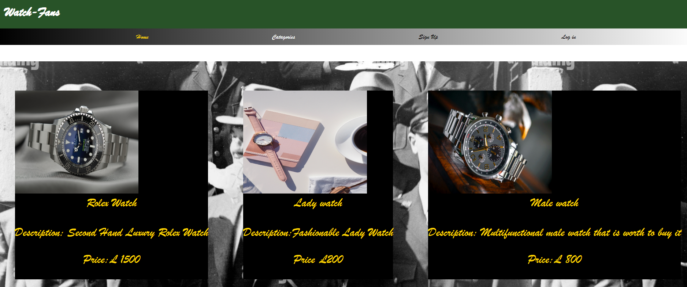

# ⌚ Watch-fans

## ✍️ Description
This application is an E-commerce website targeting watch enthusiast, the application uses: React for the client side, GraphQl on the server-side and a No-SQL database.
The website advertises a plethora of differing watches ranging from luxury, vintage to various era and much more.
***

## 👨🏼‍💻Technology used

- React
- MongoDB
- Graphql
***

## 📷Screenshot

***

## 📙Functionality
 

### Sign Up
1. By clicking the sign up button at the navigation bar to create an new account.
2. Create an username, email and password.
3. Clicking the sign up button to finish the registration
4. After registration, you will be automatically log-in
5. Your username will be shown below the navigation bar

### Logout
1. click the log out button at the navigation bar

### Login
1. Click the Login button at the navigation bar
2. Enter your username, email and password.
3. Clicking the login button to login the page
4. Your username will be shown below the navigation bar after you login successfully

***

## 🧾License
- GPL-3.0 license

***
## 📣Deployed Website Link
https://watch-fans.herokuapp.com/
***
## 🔔GitHub Repository
https://github.com/timo9939/watch-fans

